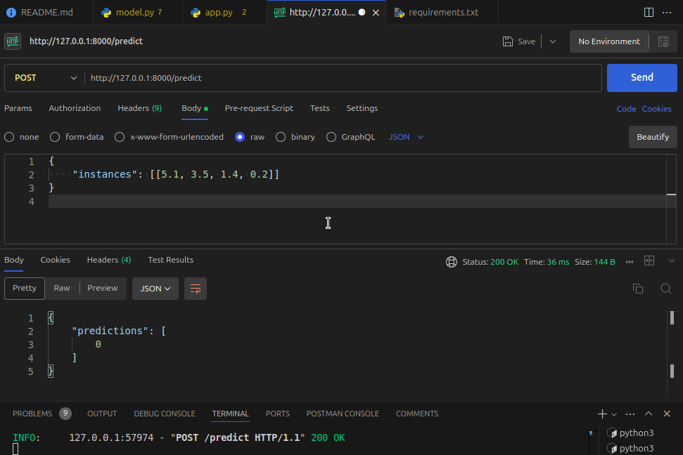

## Mlflow Registry 
In this repository, I will try to explain about Mlflow Registry. 
The below image shows the workflow of mine for this repository.
---

 
    
**First of all I will discuss about the basics of mlflow registry and then I will show you how to use it in a real-world example.**

# 🔍 What is the MLflow Model Registry?

The MLflow Model Registry is a centralized store for managing machine learning models. It is a part of the MLflow platform, providing a repository for models, along with features that enable versioning, staging, annotations, and deployment management. The Model Registry is particularly useful in MLOps workflows, where multiple models need to be tracked, tested, and deployed systematically.

🔍 Key Features of the MLflow Model Registry

- **Model Versioning:** Automatically assigns version numbers when models are registered.
- **Model Staging:** Supports stages like **None**, **Staging**, **Production**, and **Archived**.
- **Model Lineage and Annotations:** Supports descriptions, tags, and metadata for models.
- **Model Management API:** Provides REST and Python APIs for model management.
- **Model Serving:** Directly serve models as REST APIs with MLflow's built-in serving capabilities.

---

# MLflow Model Serving with FastAPI

This project demonstrates how to serve a machine learning model using MLflow's Model Registry and expose it via a FastAPI server. The model is trained on the Iris dataset using Scikit-learn's RandomForestClassifier, registered in the MLflow Model Registry, and served as a REST API for predictions.

## 📂 Project Structure

```
mlflow-model-registry-demo/
├── app.py                 # FastAPI server
├── model.py               # Model training and registration
├── requirements.txt       # Python dependencies
└── mlruns/                # MLflow experiment data (auto-generated)
```

## 🚀 Getting Started

### 🛠️ Prerequisites

- Python 3.8+
- pip (Python package installer)
- FastAPI and Uvicorn
- MLflow
- scikit-learn

### Clone the repository and navigate to the project directory.

```bash
    git clone <git@github.com:iAmAreza/Mlflow-Registry.git>
    cd <Mlflow-Registry>
```

### 📦 Install Dependencies

```bash
pip install -r requirements.txt
```

## 🔍 Model Training and Registration

```bash
python model.py
```
- This will train the model, log it to the MLflow Model Registry, and create an experiment called **IrisModelExperiment**.

## 🚦 Start the MLflow Model Server

```bash
mlflow models serve -m "models:/IrisModel/1" -p 1234 --no-conda
```
❓ **Why Use --no-conda?**

- The --no-conda flag is used to bypass the creation of a new Conda environment when serving the model.

- It allows MLflow to use the existing Python environment (e.g., a virtual environment created with venv or system Python).

- Helps avoid issues related to pyenv or Conda not being installed.

## 🌐 Start the FastAPI Server

```bash
uvicorn app:app --reload --port 8000
```

## 🧪 Test the API with Curl or Postman

```bash
curl -X POST -H "Content-Type: application/json" \
    -d '{"instances": [[5.1, 3.5, 1.4, 0.2]]}' \
    http://127.0.0.1:8000/predict
```

## 📋 API Endpoints

### 1. **Health Check**
```http
GET / 
```
- **Response:**
```json
{"message": "FastAPI server is running!"}
```

### 2. **Model Prediction**
```http
POST /predict
```
- **Request Body:**
```json
{
    "instances": [[5.1, 3.5, 1.4, 0.2]]
}
```
- **Possible Responses:**
```json
{
    "predictions": [0]
}
```
- **Error Response Example:**
```json
{
    "detail": "Invalid input data format. Please provide 'instances' as a list of lists."
}
```



## 📝 Conclusion

This project provides a **clean and robust method** to **serve machine learning models** using **MLflow** and **FastAPI**. By combining the **model management capabilities of MLflow** with the **flexibility of FastAPI**, you can easily **integrate machine learning models** into **production-ready APIs**.

